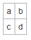

<style>
  table:not(.df_tb) {
    width:80%;
    margin-left: auto;
    margin-right: auto;
  }
  tr:not(.dftbtr), td:not(.dftbtd), th:not(.dftbth) {
    border: 1px solid lightgrey;
  }
</style>

# **Rubato**

- [**Rubato**](#rubato)
- [Overview](#overview)
- [Contact](#contact)
- [Why Should We Use Rubato](#why-should-we-use-rubato)
- [Syntax Guide](#syntax-guide)
    - [Example:](#example)
  - [Expressions](#expressions)
    - [**Text**](#text)
    - [**Lists**](#lists)
    - [**Table**](#table)
    - [**Other**](#other)

# Overview

Rubato is a light weight markup language used by all Explanatory QnA scenarios. "Rubato" is originally a musical term referring to expressive and rhythmic freedom by a slight speeding up and then slowing down of the tempo. With only slight changes, it makes the music live and it makes our answers vivid.

The most important function for Rubato is to provide necessary formatting support for answer text in a less verbose way. It currently supports bold, italic, underline, superscript, subscript, paragraph, list, unordered list, images, hyperlinks, and table. Another function of Rubato is for text mining. Using Rubato library, we can easily convert HTML into Rubato parser tree, excluding great amount of useless content, and there are also plenty of utility functions in the library to assist text mining tasks. Health scenario, as a successful example, uses Rubato as the end to end language, from text mining, feature extraction to answer rendering.

<br>

# Contact

If you have any questions or suggestions, contact [Anunay Kumar](mailto:anunayk@microsoft.com)

<br>

# Why Should We Use Rubato

* **It is simple**: It can be considered as a subset of HTML, with only useful formats for Bing answer text. So the backend has less concern of unexpected tags and other formatting issues and the frontend has a common module for rendering Rubato expressions.
* **It is compact**: The overhead is very small, even smaller than binary format data. Here is an example of HTML and Rubato expressions for the same paragraph+list
  * **HTML**: ```<p><strong>list</strong></p><ul><li>a</li><li>b</li><li>c</li></ul>```
  * **Rubato**: ```[\$[&list&]$][*a*b*c*]```
* **It is readable**: Since it's in string format, you can easily understand the content, this is very useful for debugging and DRI works.
* **Is is easy to use**: See the examples below.
* **It is fast, with little dependency**: Both C# and C++ libraries are carefully written for optimal performance. Core functions such as constructing and parsing are in sub-millisecond level. Core functions have no dependency on other libraries. Html parsing function (C#) has dependency on HtmlAgilityPack

<br>

# Syntax Guide

Rubato expressions must be prefixed with this tag: `[[RUBATO]]`

### Example:
```[[RUBATO]][$This is a Rubato text element$]```


<br>

## Expressions
<br>

### **Text**

Syntax | Display | HTML Output| Description
-------|---------|------------|------------
`text`|text|`text`|Plain text
`[$text$]`|text|`<p>text</p>`|Text within paragraph element
`[&text&]`|<b>text</b>|`<b>text</b>`|Bold text
`[/text/]`|<em>text</em>|`<em>text</em>`|Italic text
`[_text_]`|<u>text</u>|`<u>text</u>`|Underlined text
`[^text^]`|<sup>text</sup>|`<sup>text</sup>`|Superscript text
`[,text,]`|<sub>text</sub>|`<sub>text</sub>`|Subscript text

<br>

### **Lists**

Syntax | Display | HTML Output| Description
-------|---------|------------|------------
`[*a*b*c*]`|<ul class="b_vList b_divsec b_bullet"><li>a</li><li>b</li><li>c</li></ul>|```<ul class="b_vList b_divsec b_bullet">```<br>&#8195;`<li>a</li>`<br>&#8195;`<li>b</li>`<br>&#8195;`<li>c</li>`<br>`</ul>`|Unordered list
`[#a#b#c#]`|<ol class="b_dList"><li>a</li><li>b</li><li>c</li></ol>|`<ol class="b_dList">`<br>&#8195;`<li>a</li>`<br>&#8195;`<li>b</li>`<br>&#8195;`<li>c</li>`<br>`</ol>`|Ordered list

<br>

### **Table**

Syntax | Display | HTML Output| Description
-------|---------|------------|------------
`[|a|b+c|d|]`||`<table class="df_tb">`<br>&#8195;`<tr>`<br>&#8195;&#8195;`<td>a</td>`<br>&#8195;&#8195;`<td>b</td>`<br>&#8195;`</tr>`<br>&#8195;`<tr>`<br>&#8195;&#8195;`<td>c</td>`<br>&#8195;&#8195;`<td>d</td>`<br>&#8195;`</tr>`<br>`</table>`|Table

<br>

### **Other**

<table style="width:80%">
  <tr>
    <th>Syntax</th>
    <th>Display</th>
    <th>HTML Output</th>
    <th>Description</th>
  </tr>
  <tr>
    <td style="width:20%;"><code>\[\/text\/\]</code></td>
    <td>[/text/]</td>
    <td><code>[/text/]</code></td>
    <td>This example shows that you can escape characters that are recognized by the rubato parser such that they will appear as plain text. Use '/' escape characters.</td>
  </tr>
</table>
